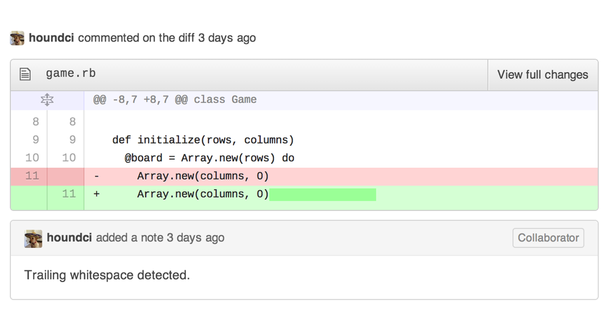
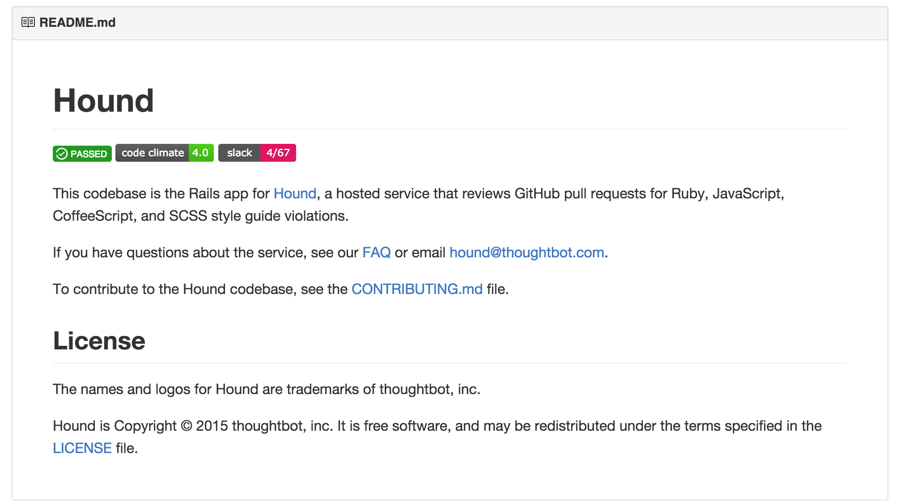
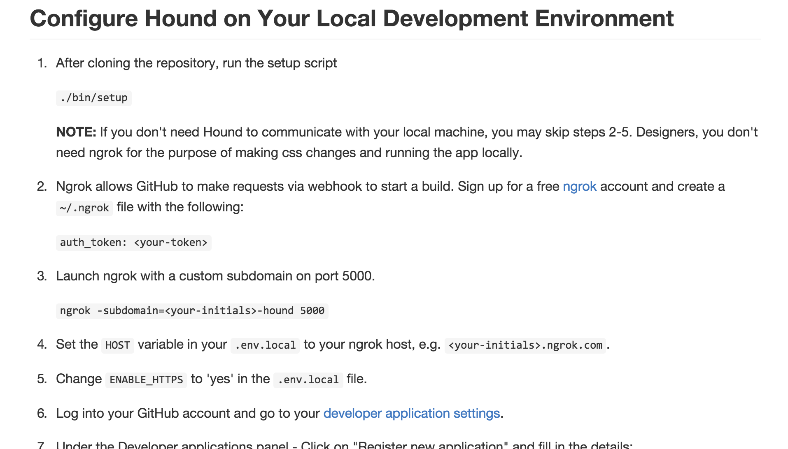
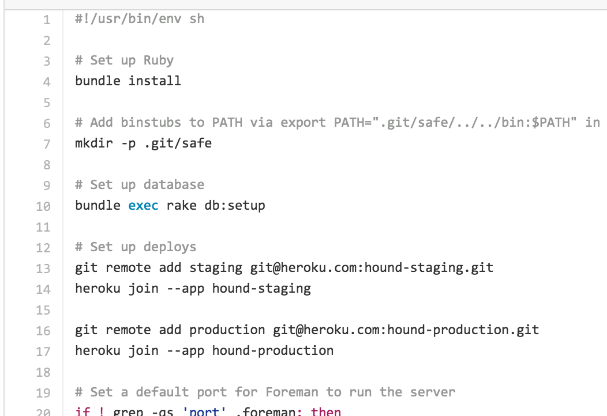
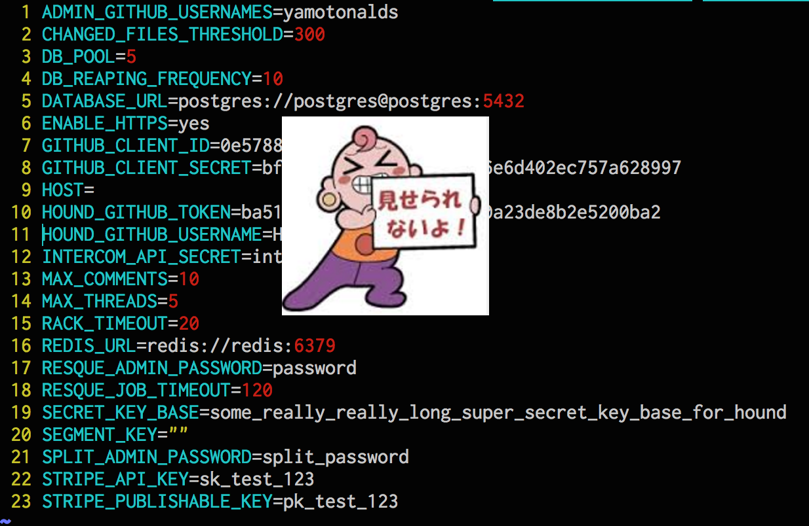
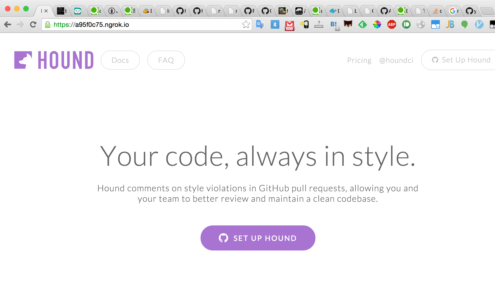

% Houndを試す-前編-
% yamotonalds
% 2015-12-08

## みなさんHound CIは覚えてますか？


## Hound CIとは

コーディング規約違反をチェックしてくれるCIサービス

. . .

**thoughtbot製**

## 対応言語

* **Ruby(Rubocop)　　　**

. . .

* CoffeeScript(CoffeeLint)
* JavaScript(JSHint)
* SCSS(SCSS-Lint)
* Haml(haml-lint)
* Go
* Python(Flake8)

. . .

よく使うものは大体カバーされてる

## 違反してるとGitHubにコメントしてくれる



## それの何が良いの？

* 見やすい
* 一箇所（GitHub）にまとまる

. . .

* **人が言わなくて良い　　　　**

人が言うと言う方も言われる方も嫌な気持ちになる
（場合がある）

## でもお高いんでしょう？

* OSS → $0
* Private Repo → $12/month

## ところで

Hound CI自体がOSSなんですよね

. . .

自前でホスティングするか


# Houndを起動するまで

## まずはGitHubを見る

https://github.com/thoughtbot/hound



## なるほどわからん

## 調べてみると

CONTRIBUTING.mdにローカルで起動する方法が書いてあるらしい



## bin/setup



## 

(´・ω・｀)

## とりあえずDB初期化してrailsが動けばええやろ

## 試行錯誤した結果

以下のものがあれば動くっぽい

* postgres
* redis
* .envにある環境変数
* DATABASE_URL環境変数

## 用意した

## docker-compose.yml

```yml
hound:
  image: hound:0.0.2
  ports:
    - "5000:5000"
  links:
    - redis
    - postgres
  env_file: .env

redis:
  image: redis

postgres:
  image: postgres
```

## hound:0.0.2のDockerfile

```
FROM ruby:2.2
ENV HOME /root
WORKDIR $HOME

RUN apt-get update && apt-get install git
RUN git clone https://github.com/thoughtbot/hound.git
WORKDIR $HOME/hound
RUN echo 'gem "therubyracer"' >> Gemfile && echo 'gem "foreman"' >> Gemfile
RUN gem install bundler
RUN bundle install --without test development

ENV RAILS_ENV production
ADD .env $HOME/hound/

CMD bundle exec rake db:create && bundle exec rake db:migrate && \
  bundle exec rake assets:precompile && bundle exec foreman start
```

## .env



## $docker-compose up -d



#

## 今後

* OAuth(?)でGitHub認証するためにHoundサーバーに外部(GitHub)からアクセスできるようにする
* リポジトリを登録して動作確認
* **Privateでもお金を取らないようにする**

# ご清聴ありがとうございました
